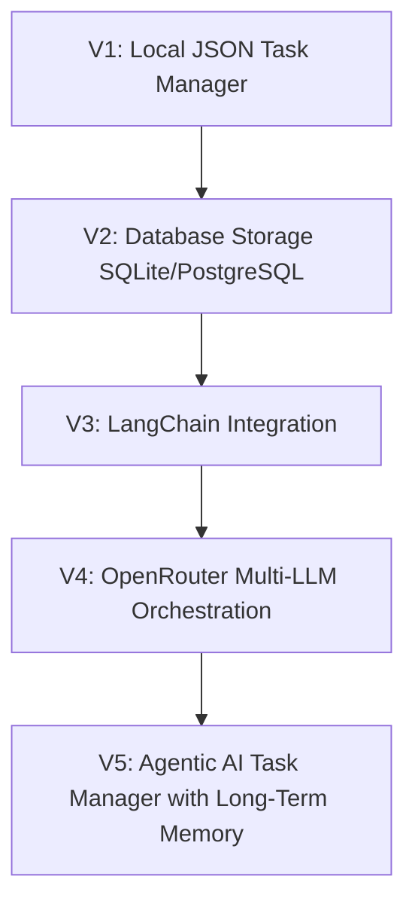

# AI Task Manager

AI Task Manager is a modular, production-ready **Streamlit Web Application** designed as a robust foundation for task planning and tracking. Built with clean architecture principles and separation of concerns, the project is structured to easily scale and gradually evolve into an **Agentic AI Assistant** using **LangChain** and **OpenRouter**.

---

## 🚀 Project Overview

The AI Task Manager serves as a structured platform for managing tasks. Its components are decoupled into clean layers (Data Models, Business Services, Streamlit UI View, Utilities) allowing developers to substitute storage engines or upgrade interface layers without impacting core business logic.

---

## ✨ Features

- **Linear-Style SaaS UI:** Premium dark purple layout using glassmorphism card styling, custom fonts (`Plus Jakarta Sans`), and progress counters.
- **Pydantic Validation:** Strict type hints and validation schemas for tasks (e.g., minimum title length, positive ID validation, priority enum limits).
- **CRUD Operations:** Seamlessly add, view, complete, and delete tasks.
- **Toolbar Filtering & Sorters:** Search, Status filters (`All`, `Pending`, `Completed`), Priority level filters (`All`, `High`, `Medium`, `Low`), and Sort options (`Newest`, `Oldest`, `High Priority`, `Low Priority`) in a single toolbar.
- **Database Sync Timestamps:** Displaying the database last sync modification time in the sidebar.
- **UX Loader States & Toasts:** Spinner loader overlays and toast alerts for every CRUD operation.
- **JSON Persistence:** Automatic serialization and atomic disk-writes to prevent data corruption.
- **Logging & Decorators:** Dual-handler logging (`INFO` level to both console/stderr and `logs/app.log`) with decorators for automatic method execution tracing.

---

## 📁 Folder Structure

```text
AI-task-manager/
│
├── app.py                  # Main Streamlit web application view
├── requirements.txt         # Project dependencies (Streamlit, Pydantic, etc.)
├── README.md                # Project documentation
├── .gitignore              # Files to ignore in Git version control
│
├── models/
│   ├── __init__.py
│   └── task.py             # Task data model using Pydantic
│
├── services/
│   ├── __init__.py
│   └── task_manager.py     # TaskManager class (CRUD logic and statistics)
│
├── utils/
│   ├── __init__.py
│   ├── logger.py           # Logger configuration (Console & File logging)
│   ├── decorators.py       # Custom log decorators for method tracking
│   └── helpers.py          # Visual table helpers
│
├── data/
│   └── tasks.json          # Main task repository file
│
├── logs/
│   └── app.log             # Application audit log file
│
└── tests/
    └── test_task_manager.py# Automated unit tests
```

---

## 🛠️ Technologies

- **Frontend/UI:** Streamlit, Pandas, Plotly
- **Language:** Python 3.8+ (Designed and verified with Python 3.13)
- **Validation:** Pydantic v2 (for model validation and serialization compatibility)
- **Standard Libraries:** `datetime`, `json`, `logging`, `unittest`, `tempfile`

---

## 📥 Installation

1. Navigate to the root directory of the project:
   ```bash
   cd c:\Users\komal.asawar\Desktop\AI_Internship\office_tasks\AI-task-manager
   ```

2. Activate the existing virtual environment (or create one using `python -m venv venv` if missing):
   - **On Windows (PowerShell):**
     ```powershell
     .\venv\Scripts\Activate.ps1
     ```
   - **On Windows (CMD):**
     ```cmd
     venv\Scripts\activate.bat
     ```
   - **On Linux/macOS:**
     ```bash
     source venv/bin/activate
     ```

3. Install project dependencies:
   ```bash
   pip install -r requirements.txt
   ```

---

## 🖥️ Usage

Run the Streamlit web application:
```bash
streamlit run app.py
```

### Running Automated Tests
The project contains unit tests verifying task management actions, validation, and JSON serialization. Execute them with:
```bash
python -m unittest discover -s tests -p "test_*.py"
```

---

## 🔮 Future Roadmap

This application's architecture is built specifically to accommodate evolutionary increments without design changes:



1. **Database Migration:** Replace the local `tasks.json` storage with SQLite/PostgreSQL database engines using SQLModel or SQLAlchemy.
2. **LangChain & OpenRouter Integration:** Evolve the core application into an agentic AI assistant. The assistant will leverage LangChain for agentic execution flows (using tools to modify and query tasks) and OpenRouter to dynamically route requests to optimal LLMs (e.g., Claude, Gemini, GPT-4o).
3. **Agentic Memory System:** Build vector-based semantic memory layers to track user preferences, task histories, and automate task breakdown schedules.